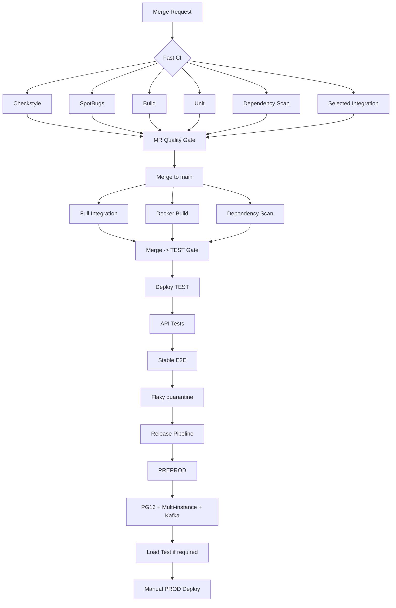
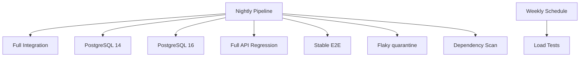

# 1. Распределите проверки

В проекте Unit занимают 3 минуты, Integration - 16 минут, API - 12 минут, E2E - 30 минут. При этом обратная связь по MR должна быть получена максимум за 10 минут.

| Проверка | Когда запускается | Blocking / non-blocking | Обоснование |
|---|---|---|---|
| Checkstyle | каждый MR | Blocking | 30 сек., быстрая проверка |
| SpotBugs | каждый MR | Blocking | 1 мин., поиск дефектов |
| Build | каждый MR, `main` | Blocking | код должен собираться |
| Unit | каждый MR | Blocking | 3 мин., можно запускать весь набор |
| Integration selected | MR при изменениях `bookings`, `rooms`, `notifications`, `common` | Blocking | проверка критичных изменений до merge |
| Integration full | после merge в `main`, nightly | Blocking | 16 мин. не помещаются в MR SLA |
| API | после deploy на TEST | Blocking перед PROD | работают на тестовом окружении |
| E2E stable | после API на TEST | Blocking перед PROD | проверяют основные бизнес-сценарии |
| E2E flaky | TEST, nightly | Non-blocking временно | запускаются через quarantine (временная изоляция нестабильных тестов) |
| Dependency scan | каждый MR, nightly | Blocking для Critical/High | уже был случай критичной уязвимости |
| Docker build | `main`, при изменении Dockerfile - MR | Blocking | проверка возможности собрать image |
| Load tests | перед крупным релизом, weekly | Blocking для крупного релиза | занимают 45 минут |

---

# 2. Quality gates

## Merge Request -> Merge

Обязательно должны пройти:

- Checkstyle;
- SpotBugs;
- Build;
- Unit;
- Dependency scan;
- selected Integration для изменённых критичных модулей;
- минимум 1 approve.

Для `bookings` обязательно включить тесты пересечения и конкурентного бронирования, потому что такой дефект уже попадал в `main`.

## Merge -> TEST

Deployment на TEST блокируют:

- ошибка Build;
- ошибка Unit;
- ошибка full Integration;
- Critical/High vulnerability;
- ошибка Docker build.

После этого Docker image разворачивается на TEST.

## TEST -> PROD

Релиз блокируют:

- падение API;
- падение стабильных E2E;
- падение критичных Integration;
- Critical/High vulnerability;
- неуспешные release-specific проверки;
- для крупного релиза - неуспешный Load test.

PROD deployment остаётся ручным.

---

# 3. Ограничение MR - 10 минут

На MR проверки запускаются параллельно:

```text
MR
├── Checkstyle       ~0.5 мин
├── SpotBugs         ~1 мин
├── Build            ~2 мин
├── Unit             ~3 мин
├── Dependency scan  ~2 мин
└── Selected Integration <= 10 мин
```

Полный Integration suite на MR не запускается, потому что он занимает 16 минут.

Используется **test selection**:

- изменения `bookings` -> overlap, concurrency, cancel;
- `rooms` -> availability/slots;
- `notifications` -> Kafka integration;
- `common` или `pom.xml` -> расширенный critical integration набор.

API и E2E на MR не запускаются, потому что TEST один и несколько pipeline не могут безопасно работать с ним одновременно.

---

# 4. Работа с flaky-тестами

Есть 5 нестабильных E2E.

**Должны ли блокировать release?**

Стабильные E2E - да.

Flaky E2E можно временно вынести из blocking gate только в quarantine (временная изоляция нестабильных тестов).

**Использовать ли retry?**

Да, максимум 1 retry для диагностики.

**Что означает успешный retry?**

```text
fail -> retry pass = flaky/unstable
```

Это не считается обычным успешным прохождением.

**Можно ли временно исключить тест?**

Да, если:

- создан bug/task;
- назначен ответственный;
- тест остаётся в nightly/quarantine;
- критичная логика покрыта другим стабильным тестом.

**Что дальше?**

Тест необходимо исправить и вернуть в blocking suite.

Просто игнорировать первое падение нельзя: в проекте уже был случай, когда такой E2E действительно обнаружил дефект освобождения слота.

---

# 5. Продуктовые планы: повторяющиеся бронирования

Функция считается критичной.

## Новые проверки

**Unit:**

- генерация серии дат;
- проверка каждого временного слота;
- обработка конфликта;
- валидация начала и окончания серии.

**Integration:**

- из 10 бронирований одно пересекается;
- два пользователя одновременно создают одну серию;
- ошибка на середине создания серии;
- rollback данных;
- отсутствие двойных бронирований.

**API:**

- успешное создание серии;
- конфликт одного элемента серии;
- ошибка запроса.

**E2E:**

- создать серию -> проверить занятые слоты;
- отменить серию -> проверить освобождение слотов.

## Какие проверки должны быть blocking

Blocking:

- conflict detection;
- concurrent series creation;
- rollback;
- отсутствие overlapping bookings.

## Изменения pipeline

Для изменений `bookings` новые `recurring-critical` Integration tests должны запускаться уже на MR.

Полный набор запускается после merge и перед PROD.

## Сценарии для regression

1. 10 бронирований, одно конфликтует.
2. Два пользователя одновременно создают серию.
3. Ошибка после частичного выполнения операции.
4. Отмена серии.
5. Изменение серии.
6. Проверка освобождения слотов.

---

# 6. Технические планы

## PostgreSQL 14 -> 16

Нужны Integration tests одновременно на PostgreSQL 14 и 16.

```text
Integration
├── PostgreSQL 14
└── PostgreSQL 16
```

Запуск:

- nightly;
- перед release с PostgreSQL 16.

Проверить:

- repositories;
- transactions;
- migrations;
- concurrency;
- constraints.

TEST сейчас остаётся на PostgreSQL 14, поэтому перед PROD нужен отдельный environment с PostgreSQL 16.

---

## PROD: 3 -> 8 instances

Одного TEST instance недостаточно для проверки distributed race conditions.

Нужно отдельное PREPROD окружение с несколькими instances.

Проверить:

- конкурентное создание booking через разные instances;
- отсутствие double booking;
- Redis/shared state;
- DB locking;
- нагрузку;
- restart одного instance.

Перед переходом на 8 instances Load tests становятся Blocking.

---

## Увеличение Kafka consumers

Добавить проверки:

- duplicate message;
- повторная доставка;
- consumer restart;
- consumer rebalance;
- несколько consumers;
- message loss;
- duplicate notification;
- idempotency.

Запуск:

- Integration - `main` и nightly;
- E2E - PREPROD;
- критичные Kafka scenarios - перед PROD.

---

# Основная схема Pipeline



# Nightly Pipeline


